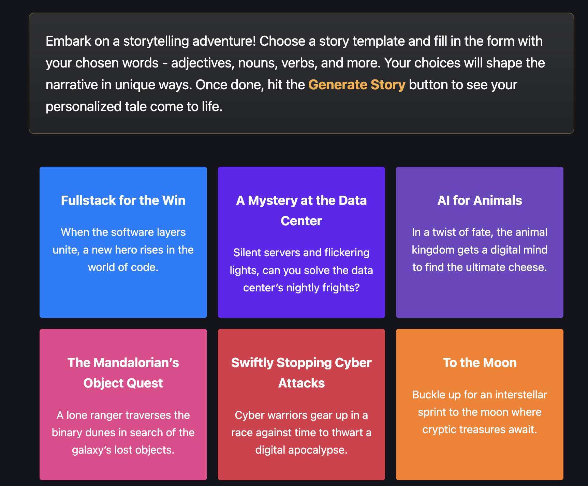

# Cloudy MadLib Game


### Running Locally

```sh
git clone git@github.com:lauragift21/cf-madlibs-game.git
```



## 🧞 Commands

All commands are run from the root of the project, from a terminal:

| Command                   | Action                                           |
| :------------------------ | :----------------------------------------------- |
| `npm install`             | Installs dependencies                            |
| `npm run pages:dev`             | Starts local dev server at `localhost:4321`      |
| `npm run pages:deploy`           | Build your production site to `./dist/` and deploy to Cloudflare Pages      |

## 👀 Want to learn more?

Feel free to check [our documentation](https://developers.cloudflare.com/) or join us on our [Discord server](https://discord.gg/cloudflaredev).
